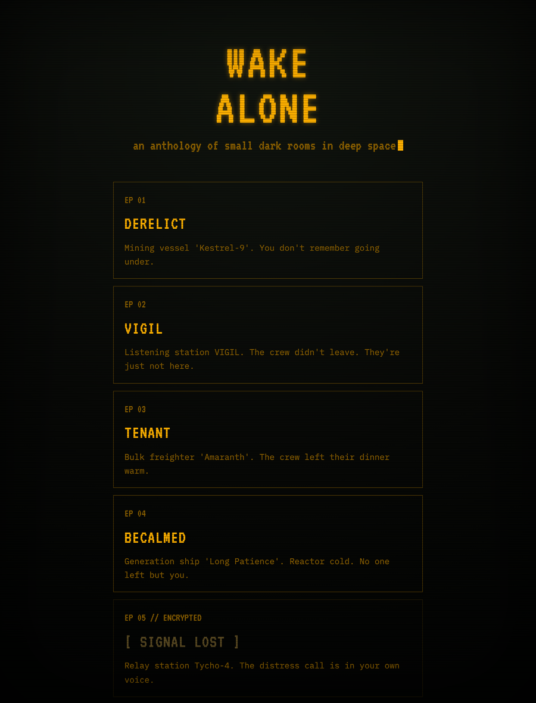
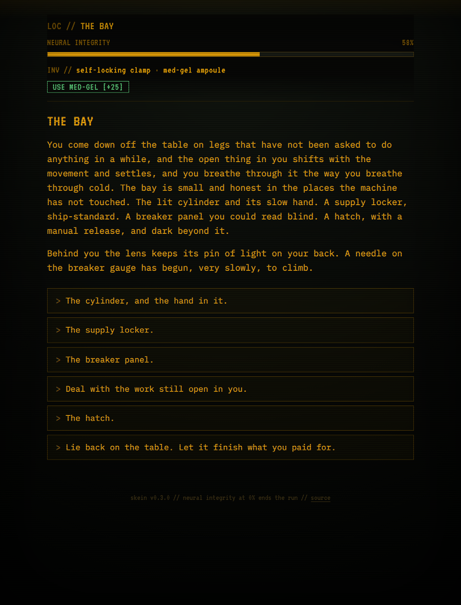
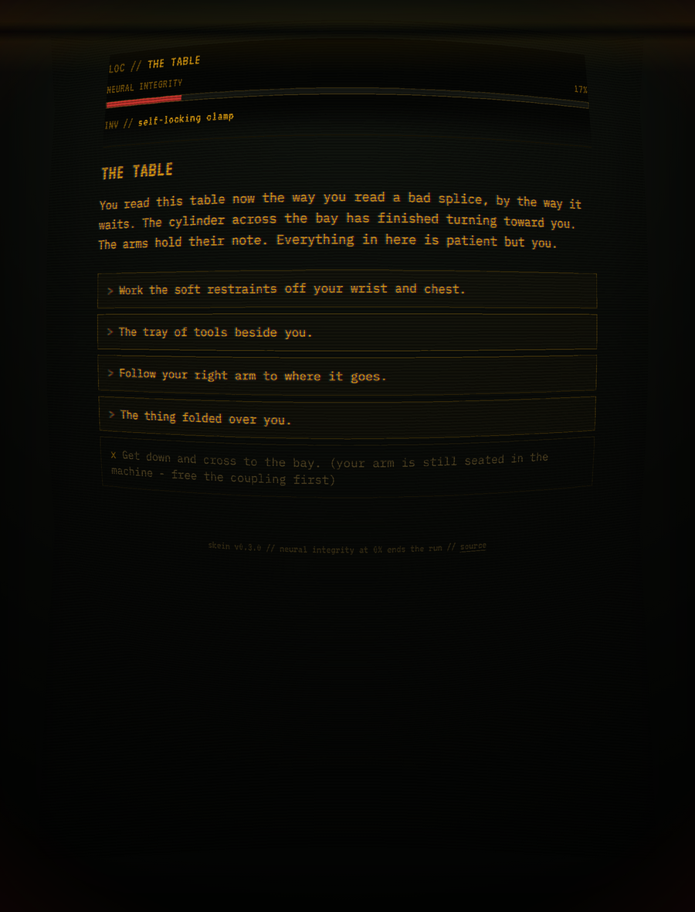

# WAKE ALONE

[](https://github.com/mandakan/wake-alone/actions/workflows/ci.yml)
[](https://github.com/mandakan/wake-alone/actions/workflows/release-please.yml)
[](https://github.com/mandakan/wake-alone/actions/workflows/deploy-staging.yml)
[](https://wake.urdr.dev)
[](LICENSE)

An ever-expanding anthology of *wake-up-alone-in-deep-space* horror choose-your-own-adventures.
Episodes are written as JSON; a single static HTML engine - **skein** - plays them. It is
deterministic: the AI writes the stories at authoring time, and nothing is generated during play.
Every branch, item, and ending is pre-written.

**Play it now at [wake.urdr.dev](https://wake.urdr.dev).**

## Screenshots

<p align="center">
  
</p>

<table>
<tr>
<td width="50%"></td>
<td width="50%"></td>
</tr>
<tr>
<td align="center"><em>In play: the HUD tracks neural integrity and inventory; med-gel buys it back.</em></td>
<td align="center"><em>Sanity degrades the screen itself - glitch, vignette, and the prose goes wrong.</em></td>
</tr>
</table>

## The premise

You wake alone in a deep-space setting - a derelict, a station, a long-haul freighter - with no
memory of how you got there and something already wrong. The horror is *attention*: the sense of
being watched, of a wrongness that waits. Dread over gore. You read, you choose, your **neural
integrity** drains as the place works on you, and you try to assemble an escape before it hits zero
and your mind goes with it.

Episodes so far:

| # | Episode | Hook |
|---|---------|------|
| 01 | **DERELICT** | Mining vessel *Kestrel-9*. You don't remember going under. |
| 02 | **VIGIL** | Listening station VIGIL. The crew didn't leave. They're just not here. |
| 03 | **TENANT** | Bulk freighter *Amaranth*. The crew left their dinner warm. |
| 04 | **BECALMED** | Generation ship *Long Patience*. Reactor cold. No one left but you. |
| 05 | **WARD** | Recovery berth, freighter *Anodyne*. The voice says you are healing. The frost disagrees. |
| 06 | **GRAFT** | Auto-surgery, clinic-ship *Halcyon*. You signed for one repair. It is still working. |

(*SIGNAL LOST* is encrypted on the menu - locked until it is written.)

## Quickstart (Node 18+, no dependencies)

```bash
npm run new -- --id tycho --title "Signal Lost"   # scaffold a valid episode
npm run validate                                  # check every episode
npm run build                                     # -> dist/index.html (standalone)
open dist/index.html                              # play
```

`dist/index.html` is fully self-contained (episodes inlined, fonts via CDN) - host it as a static
file anywhere, or open it directly.

## How it fits together

**skein** is the engine (genre-agnostic; it plays any episode JSON). **WAKE ALONE** is the anthology
built on it. They live in one repo for now; extract `engine/` + `tools/` into a standalone `skein`
repo only if a second anthology ever needs the engine.

- **`episodes/*.json`** - the content. One file per adventure. Schema and creative bible in `CLAUDE.md`.
- **`tools/validate.mjs`** - the guardrail. A sanity-aware solver proves at least one *survivable*
  path reaches an escape, and it catches dangling pointers, orphans, dead ends, soft-locks (a
  required item/flag never obtainable), and misspelled gate keys. Exits non-zero on any error.
- **`tools/prose-lint.mjs`** - flags the mechanical tells of generated slop (non-ASCII punctuation,
  essay register, robotic cadence) so episodes read like prose, not output.
- **`tools/build.mjs`** - validates, then inlines episodes into `engine/template.html` -> `dist/`.
- **`engine/`** - the runtime (amber-phosphor CRT/terminal aesthetic; sanity degrades the screen)
  and the inventory label map.

## Handing authoring to Claude Code

This repo is set up so Claude Code can write new episodes in a closed loop:

1. Put the repo on your box and `git init` it.
2. `CLAUDE.md` (repo root) is read automatically as project memory - it holds the schema, the
   creative bible, and the rule *"not done until `npm run validate` exits 0"*.
3. `.claude/skills/author-episode/SKILL.md` is the invocable procedure for "write a new episode".
4. Because the validator is a plain command, Claude Code runs it itself and iterates
   (generate -> validate -> fix -> build) without you in the loop.

The craft rules learned from playtest feedback live in `docs/craft-lessons.md`; the prose mode is
documented in `docs/gestalt.md`. Optional: wire `npm run validate` into a Claude Code hook so it
runs automatically after edits.

## Contributing

See [`CONTRIBUTING.md`](CONTRIBUTING.md) for the episode workflow, the
[Conventional Commits](https://www.conventionalcommits.org) convention that drives
releases, and how staging/production deploys work.
